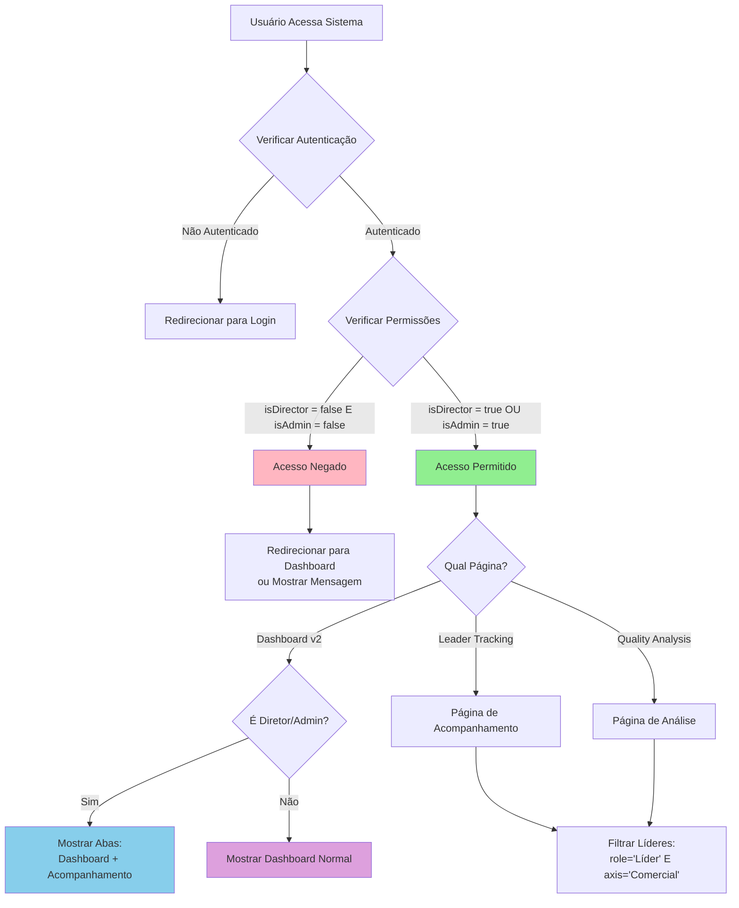
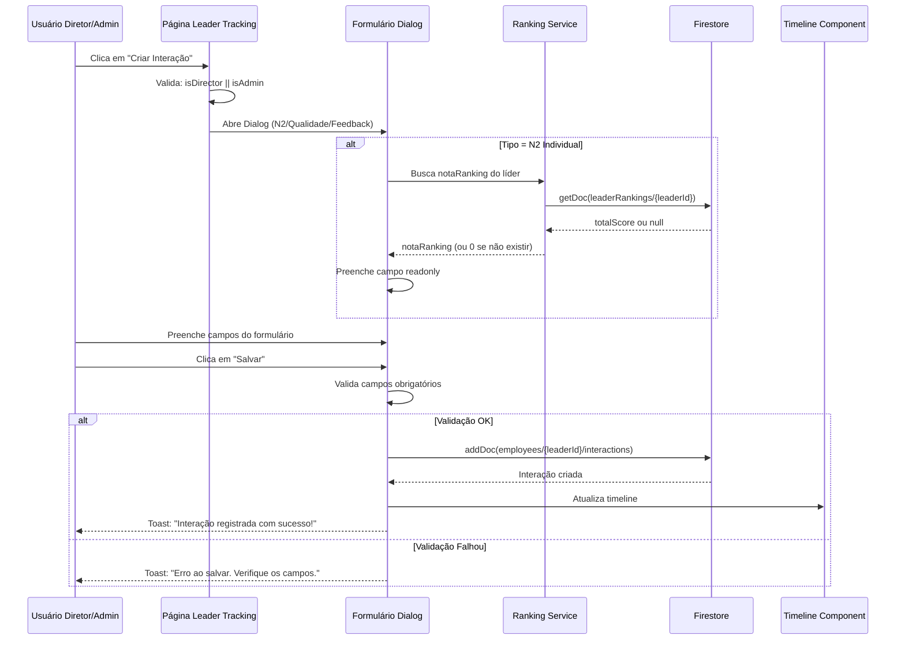
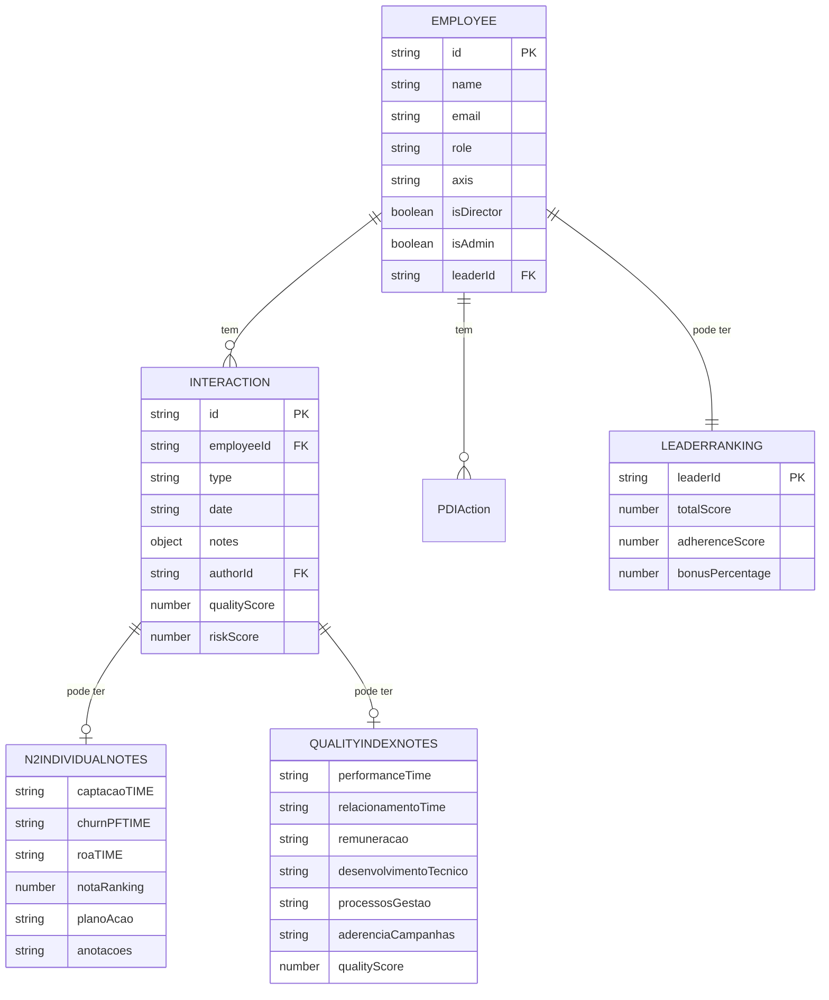
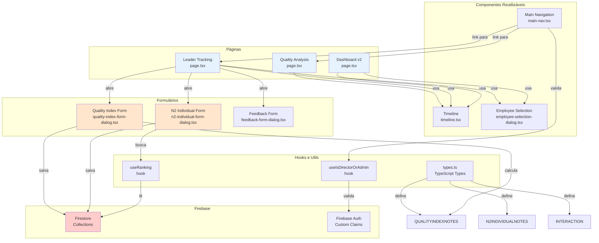
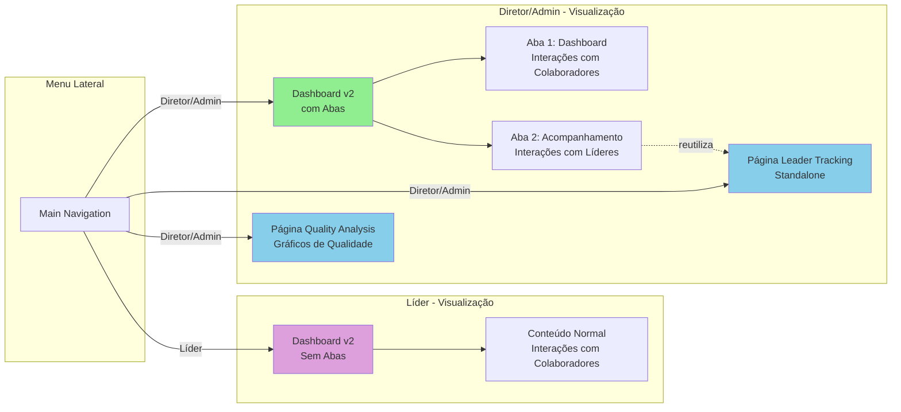
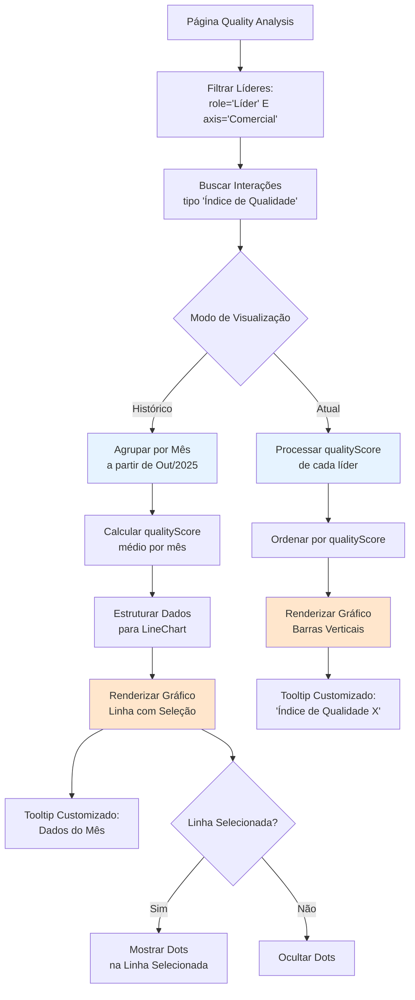
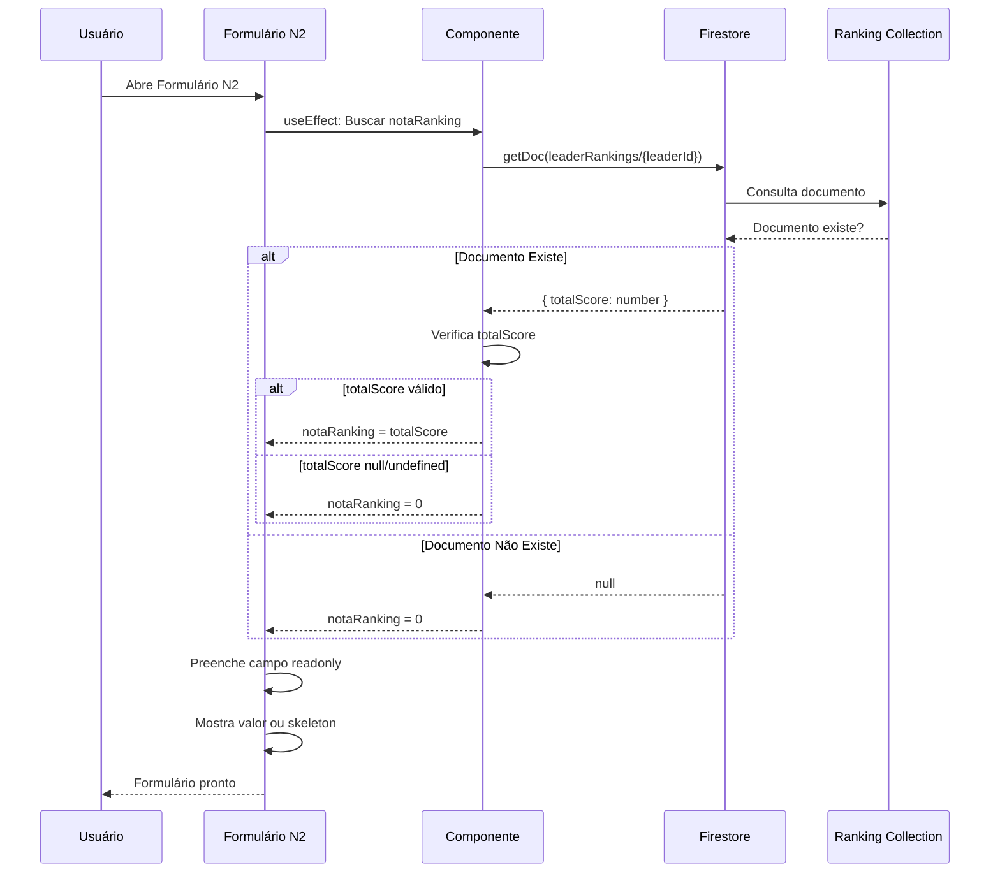

# Sistema de Acompanhamento de Líderes por Diretores e Admins

## 📋 PLANO UNIFICADO DE IMPLEMENTAÇÃO

**Última atualização:** Consolidado com requisitos de abas no dashboard v2 + Melhorias de especificação (Estados de UI, detalhes de ranking, validações)

### RESUMO EXECUTIVO
- **Objetivo:** Criar sistema para Diretores e Admins acompanharem Líderes
- **Acesso:** Restrito apenas a Diretores (`isDirector === true`) e Admins (`isAdmin === true`)
- **Novos tipos de interação:** N2 Individual e Índice de Qualidade
- **Páginas novas:** Acompanhamento de Líderes, Análise de Qualidade
- **Dashboard v2:** Sistema de abas APENAS para diretores/admins (2 abas: Dashboard e Acompanhamento de Líderes)
- **Líderes:** Continuam com visualização normal (sem abas)

## 1. TAREFA PRINCIPAL
Criar sistema completo para Diretores e Admins acompanharem Líderes, permitindo registro de interações N2 Individual e Índice de Qualidade, com páginas de acompanhamento e análise de qualidade similar ao sistema existente de líderes acompanhando colaboradores.

**IMPORTANTE:** 
- TODAS as funcionalidades são restritas apenas a Diretores (`isDirector === true`) e Admins (`isAdmin === true`)
- Dashboard v2 terá sistema de abas APENAS para diretores/admins (líderes continuam com visualização normal)

## 2. REQUISITOS FUNCIONAIS

### 2.1. Novos Tipos de Interação
- [ ] Adicionar "N2 Individual" ao tipo InteractionType
- [ ] Adicionar "Índice de Qualidade" ao tipo InteractionType
- [ ] Criar interface N2IndividualNotes com campos:
  - captacaoTIME (string)
  - churnPFTIME (string)
  - roaTIME (string)
  - notaRanking (number) - preenchido automaticamente do ranking (readonly)
  - planoAcao (string)
  - anotacoes (string)
- [ ] Criar interface QualityIndexNotes com sistema de flags:
  - performanceTime: "red" | "neutral" | "green"
  - relacionamentoTime: "red" | "neutral" | "green"
  - remuneracao: "red" | "neutral" | "green"
  - desenvolvimentoTecnico: "red" | "neutral" | "green"
  - processosGestao: "red" | "neutral" | "green"
  - aderenciaCampanhas: "red" | "neutral" | "green"
  - qualityScore: number (calculado: Red=-1, Neutro=0, Green=+1, range -6 a +6)

### 2.2. Página de Acompanhamento de Líderes (APENAS Diretores e Admins)
- [ ] Criar `src/app/dashboard/leader-tracking/page.tsx` (página standalone para acesso direto via menu)
- [ ] **VALIDAÇÃO DE ACESSO:** Verificar `isDirector || isAdmin` no início do componente
- [ ] **REDIRECIONAMENTO:** Se não for diretor/admin, redirecionar para dashboard ou mostrar mensagem de acesso negado
- [ ] Filtrar apenas colaboradores com `role === "Líder"` e `axis === "Comercial"`
- [ ] **REUTILIZAR COMPONENTES EXISTENTES:**
  - `Timeline` component (já existe em `src/components/timeline.tsx`)
  - `EmployeeSelectionDialog` (já existe, adaptar para filtrar apenas líderes com `role === "Líder"` e `axis === "Comercial"`)
  - Estrutura similar a `individual-tracking/page.tsx` como referência
- [ ] **FLUXO IDÊNTICO AO LÍDER→COLABORADOR:**
  - Permitir seleção de líder para acompanhar (igual seleção de colaborador pelo líder)
  - Ao selecionar líder, abrir tela com timeline de interações do Diretor com este líder
  - Permitir criar interações a partir desta tela
- [ ] Permitir criar 3 tipos de interação:
  - **N2 Individual:** Usar formulário `n2-individual-form-dialog.tsx` (seguir template do print)
  - **Índice de Qualidade:** Usar formulário `quality-index-form-dialog.tsx` (seguir modelo do `RiskAssessmentFormDialog` existente)
  - **Feedback:** Usar formulário genérico já existente
- [ ] Integrar com ranking para preencher notaRanking automaticamente no formulário N2
- [ ] Se líder não estiver no ranking, notaRanking = 0
- [ ] **NOTA:** Esta página também será reutilizada como conteúdo da Aba 2 do dashboard v2 para diretores

### 2.3. Página de Análise de Qualidade (APENAS Diretores e Admins)
- [ ] Criar `src/app/dashboard/quality-analysis/page.tsx`
- [ ] **VALIDAÇÃO DE ACESSO:** Verificar `isDirector || isAdmin` no início do componente
- [ ] **REDIRECIONAMENTO:** Se não for diretor/admin, redirecionar para dashboard ou mostrar mensagem de acesso negado
- [ ] **SEGUIR MODELO DA ANÁLISE DE RISCO:** Copiar estrutura completa de `risk-analysis/page.tsx` incluindo:
  - Card de seleção de colaboradores (com botão "Selecionar Colaboradores" e "Exibir Alta Qualidade" - adaptar texto do botão)
  - Card principal com toggle entre visualização atual e histórica
  - Botão de toggle "Ranking/Histórico" (seguindo mesmo estilo visual)
  - Gráfico de barras vertical para visualização atual (qualityScore)
  - Gráfico de linha para série histórica (a partir de outubro 2025)
  - Tooltip customizado com espaço entre "Qualidade" e número
  - Sistema de seleção de linhas no gráfico histórico (com dots apenas quando selecionado)
  - Mesma estrutura de dados e processamento
- [ ] Filtrar apenas líderes (`role === "Líder"` e `axis === "Comercial"`)
- [ ] Substituir `riskScore` por `qualityScore` em toda a lógica
- [ ] Adaptar labels e textos para "Qualidade" ao invés de "Risco"

### 2.4. Dashboard V2 - Sistema de Abas para Diretores e Admins
- [ ] **MODIFICAR `src/app/dashboard/v2/page.tsx`** para implementar sistema de abas
- [ ] **VALIDAÇÃO DE ACESSO:** Abas aparecem APENAS se `isDirector || isAdmin`
- [ ] **Para Diretores/Admins:** Implementar abas seguindo modelo do painel admin:
  - Aba 1: "Dashboard" - Conteúdo atual do dashboard v2 (frequência de interações com colaboradores)
  - Aba 2: "Acompanhamento de Líderes" - Conteúdo da página leader-tracking (frequência de interações N2, Índice de Qualidade e Feedback com líderes)
- [ ] **Para Líderes:** Manter visualização normal SEM abas (comportamento atual)
- [ ] Usar componentes `Tabs`, `TabsList`, `TabsTrigger`, `TabsContent` do shadcn/ui
- [ ] Seguir estrutura visual do painel admin (`grid w-full grid-cols-2` para 2 abas)
- [ ] **Estrutura de implementação:**
  ```typescript
  // No início do componente, verificar se é diretor/admin
  const isDirectorOrAdmin = currentUserEmployee?.isDirector || currentUserEmployee?.isAdmin;
  
  // Se for diretor/admin, renderizar com Tabs
  if (isDirectorOrAdmin) {
    return (
      <Tabs defaultValue="dashboard" className="w-full">
        <TabsList className="grid w-full grid-cols-2">
          <TabsTrigger value="dashboard">Dashboard</TabsTrigger>
          <TabsTrigger value="leader-tracking">Acompanhamento de Líderes</TabsTrigger>
        </TabsList>
        <TabsContent value="dashboard">
          {/* Conteúdo atual do dashboard v2 */}
        </TabsContent>
        <TabsContent value="leader-tracking">
          {/* Componente ou conteúdo da página leader-tracking */}
        </TabsContent>
      </Tabs>
    );
  }
  
  // Se for líder, renderizar normalmente (sem abas)
  return (/* conteúdo atual */);
  ```
- [ ] Aba "Acompanhamento de Líderes" deve mostrar:
  - Frequência de interações N2 Individual
  - Frequência de interações Índice de Qualidade
  - Frequência de interações Feedback
  - Apenas líderes do time comercial (`axis === "Comercial"`)
- [ ] **Reutilização:** Pode extrair o conteúdo da aba 2 para um componente separado que também será usado na página standalone `leader-tracking/page.tsx`

### 2.5. Formulários de Interação
- [ ] Criar `src/components/n2-individual-form-dialog.tsx`
  - **SEGUIR TEMPLATE DO PRINT ENVIADO:** Implementar exatamente como mostrado na imagem
  - Campos conforme template:
    - Captação TIME (string) - placeholder="R$ 0,00" - formato sugerido: "R$ X.XXX,XX" (validação opcional, pode ser texto livre)
    - Churn PF TIME (string) - placeholder="0,00%" - formato sugerido: "X,XX%" (validação opcional, pode ser texto livre)
    - ROA TIME (string) - placeholder="0,00%" - formato sugerido: "X,XX%" (validação opcional, pode ser texto livre)
    - Nota Ranking (number, readonly, preenchido automaticamente do ranking ou 0 se não houver)
    - Plano de Ação (string) - definir se obrigatório ou opcional
    - Anotações (string) - definir se obrigatório ou opcional
  - **Validação de acesso:** Apenas diretores/admins podem abrir
  - **Validação de campos:** Definir quais campos são obrigatórios antes de salvar
  - Layout e estrutura visual conforme print
- [ ] Criar `src/components/quality-index-form-dialog.tsx`
  - **SEGUIR MODELO DO COMPONENTE `RiskAssessmentFormDialog`:** Reutilizar estrutura de UI/UX do componente existente
  - **Referência:** `src/components/risk-assessment-form-dialog.tsx` como base
  - Sistema de flags para 6 categorias (Red/Neutro/Green):
    - Performance TIME
    - Relacionamento TIME
    - Remuneração
    - Desenvolvimento Técnico
    - Processos de Gestão
    - Aderência a Campanhas
  - Calcular qualityScore automaticamente baseado nas flags (Red=-1, Neutro=0, Green=+1)
  - Salvar como interação tipo "Índice de Qualidade"
  - **Validação de acesso:** Apenas diretores/admins podem abrir
  - Layout e estrutura visual seguindo modelo do `RiskAssessmentFormDialog`

### 2.6. Integração com Ranking
- [ ] Localizar hook/função existente de ranking no projeto
- [ ] **Buscar nota do ranking do líder:**
  - Opção 1: Buscar em `/leaderRankings/{leaderId}` (coleção Firestore) - **RECOMENDADO**
  - Opção 2: Calcular dinamicamente usando lógica de `ranking/page.tsx` (mais complexo)
  - Usar campo `totalScore` do ranking (adherenceScore + bonusPercentage)
- [ ] Buscar nota no momento de abrir o formulário N2 (não na criação)
- [ ] Preencher campo notaRanking automaticamente no formulário N2
- [ ] Se líder não estiver no ranking (`leaderRankings/{leaderId}` não existir) ou `totalScore` for undefined/null, usar valor 0
- [ ] Considerar cache se houver hook `useRankingCache` disponível
- [ ] Campo deve ser readonly (não editável)
- [ ] Mostrar skeleton/loading no campo enquanto busca ranking

### 2.7. Navegação e Links
- [ ] Adicionar link "Acompanhamento de Líderes" no main-nav (apenas para diretores/admins)
- [ ] Adicionar link "Análise de Qualidade" no main-nav (apenas para diretores/admins)
- [ ] Links devem usar `requiresAuth: (user: Employee) => user.isDirector || user.isAdmin`

## 3. REQUISITOS NÃO-FUNCIONAIS
- [ ] Performance: Carregamento paralelo de dados
- [ ] Segurança: Validar que apenas Diretores e Admins podem criar interações sobre Líderes (frontend e backend)
- [ ] UX: Seguir padrões visuais existentes (cores, componentes shadcn/ui)
- [ ] Manutenibilidade: Reutilizar componentes e lógica existente quando possível
- [ ] Compatibilidade: Não quebrar funcionalidades existentes

## 4. ESTADOS DE UI

### 4.1. Estados de Loading
- [ ] Usar `Skeleton` do shadcn/ui para:
  - Lista de líderes: 5 linhas de skeleton (altura ~60px cada)
  - Timeline de interações: 3 cards skeleton
  - Gráficos: Skeleton retangular com altura do gráfico
  - Formulários: Skeleton para campo "Nota Ranking" durante busca de ranking (quando aplicável)
- [ ] Implementar loading state nos botões de submit (disabled + spinner)
- [ ] Mostrar loading state durante busca de dados do ranking no formulário N2

### 4.2. Tratamento de Erros
- [ ] Usar toast do shadcn/ui para feedback visual
- [ ] Logs estruturados no console com contexto:
  ```typescript
  console.error('[LeaderTracking] Falha ao criar interação N2:', {
    leaderId,
    errorCode: error.code,
    errorMessage: error.message,
    timestamp: new Date().toISOString()
  });
  ```
- [ ] Mensagens de erro amigáveis para o usuário:
  - "Erro ao salvar interação. Tente novamente."
  - "Você não tem permissão para esta ação."
  - "Líder não encontrado."

### 4.3. Estados Vazios
- [ ] Quando líder não tem interações: mostrar mensagem "Nenhuma interação registrada" com ícone ilustrativo
- [ ] Quando não há líderes no filtro: mostrar mensagem apropriada

### 4.4. Estados de Sucesso
- [ ] Toast de sucesso após criar interação: "Interação registrada com sucesso!"
- [ ] Atualizar timeline automaticamente após criar interação

## 5. ARQUIVOS A CRIAR/MODIFICAR

### Arquivos a Criar:
- `src/app/dashboard/leader-tracking/page.tsx` - Página de acompanhamento de líderes
- `src/app/dashboard/quality-analysis/page.tsx` - Página de análise de qualidade
- `src/components/n2-individual-form-dialog.tsx` - Formulário N2 Individual
- `src/components/quality-index-form-dialog.tsx` - Formulário Índice de Qualidade
- `src/hooks/use-is-director-or-admin.ts` - Hook para verificar permissões (opcional)

### Arquivos a Modificar:
- `src/lib/types.ts` - Adicionar novos tipos e interfaces
- `src/app/dashboard/v2/page.tsx` - **REFATORAR:** Implementar sistema de abas para diretores/admins (Dashboard e Acompanhamento de Líderes), manter visualização normal para líderes
- `src/components/main-nav.tsx` - Adicionar links com validação de acesso

## 6. RESTRIÇÕES E CONSIDERAÇÕES
- **ACESSO RESTRITO:** Apenas Diretores (`isDirector === true`) e Admins (`isAdmin === true`) podem acessar TODAS as funcionalidades
- **Validação em múltiplas camadas:**
  - Frontend: Verificar `isDirector || isAdmin` em todas as páginas e componentes
  - Navegação: Links aparecem apenas para diretores/admins
  - Backend: Firestore Rules devem validar permissões
- Filtrar apenas líderes do time comercial (`axis === "Comercial"`)
- Nota do ranking deve ser buscada no momento da criação da interação (não pode ser editada depois)
- Sistema de flags de qualidade: Red Flag = -1, Neutro = 0, Green Flag = +1 (score de -6 a +6)
- Manter compatibilidade com interações existentes
- Não expor dados sensíveis

## 7. DEPENDÊNCIAS
- Firebase Firestore (já instalado)
- Componentes shadcn/ui (já instalado)
- Recharts (já instalado)
- date-fns (já instalado)
- Hook de ranking para buscar nota do líder

## 8. TESTES NECESSÁRIOS
- [ ] **Acesso:** Apenas Diretores e Admins conseguem acessar as novas funcionalidades
- [ ] **Acesso negado:** Líderes e Colaboradores são redirecionados ou veem mensagem de acesso negado
- [ ] **Dashboard v2 - Abas:** Diretores/Admins veem abas, Líderes não veem abas (visualização normal)
- [ ] Diretor/Admin consegue ver apenas líderes do time comercial
- [ ] Diretor/Admin consegue criar interação N2 Individual
- [ ] Nota do ranking é preenchida automaticamente no N2 (ou 0 se não houver)
- [ ] Nota do ranking = 0 quando líder não está no ranking
- [ ] Diretor/Admin consegue criar interação Índice de Qualidade
- [ ] Score de qualidade é calculado corretamente baseado nas flags
- [ ] Página de análise de qualidade mostra gráficos corretos
- [ ] Links no menu aparecem apenas para Diretores e Admins
- [ ] Aba no dashboard v2 aparece apenas para Diretores e Admins
- [ ] Timeline mostra interações N2 e Índice de Qualidade corretamente
- [ ] Navegação entre abas funciona corretamente no dashboard v2
- [ ] Skeleton loading aparece durante carregamento
- [ ] Skeleton aparece no campo "Nota Ranking" durante busca
- [ ] Toast de sucesso aparece após criar interação
- [ ] Toast de erro aparece quando há falha
- [ ] Logs de erro são registrados no console com contexto
- [ ] Formatação de valores monetários e percentuais funciona corretamente (R$, %)
- [ ] Validação de campos obrigatórios funciona antes de salvar

## 9. ORDEM DE IMPLEMENTAÇÃO SUGERIDA

1. **Fase 1: Tipos e Interfaces**
   - Atualizar `src/lib/types.ts` com novos tipos de interação
   - Criar interfaces `N2IndividualNotes` e `QualityIndexNotes`

2. **Fase 2: Formulários**
   - Criar `n2-individual-form-dialog.tsx`
   - Criar `quality-index-form-dialog.tsx`

3. **Fase 3: Página de Acompanhamento**
   - Criar `leader-tracking/page.tsx` (página standalone)
   - Implementar validação de acesso
   - Implementar timeline e criação de interações

4. **Fase 4: Dashboard v2 com Abas**
   - Refatorar `dashboard/v2/page.tsx` para suportar abas
   - Implementar lógica condicional (abas para diretores, normal para líderes)
   - Integrar conteúdo da aba "Acompanhamento de Líderes"

5. **Fase 5: Página de Análise**
   - Criar `quality-analysis/page.tsx`
   - Implementar gráficos (atual e histórico)

6. **Fase 6: Navegação**
   - Adicionar links no `main-nav.tsx`
   - Implementar validação de acesso nos links

7. **Fase 7: Integração com Ranking**
   - Implementar busca de nota do ranking
   - Preencher campo readonly no formulário N2

## 10. NOTAS TÉCNICAS IMPORTANTES

### Templates dos Formulários
- **N2 Individual:** Deve seguir EXATAMENTE o template mostrado no print enviado pelo usuário
  - Campos: Captação TIME, Churn PF TIME, ROA TIME, Nota Ranking (readonly), Plano de Ação, Anotações
  - **IMPORTANTE:** Verificar print/imagem fornecida pelo usuário durante implementação para garantir layout correto
- **Índice de Qualidade:** Deve seguir EXATAMENTE o template enviado pelo usuário (com sistema de flags)
  - 6 categorias com flags (Red/Neutro/Green): Performance TIME, Relacionamento TIME, Remuneração, Desenvolvimento Técnico, Processos de Gestão, Aderência a Campanhas
  - **IMPORTANTE:** Verificar template/documentação fornecida pelo usuário durante implementação para garantir layout correto

### Página de Análise de Qualidade
- **DEVE SEGUIR O MESMO MODELO DA ANÁLISE DE RISCO:**
  - Mesma estrutura de cards
  - Mesmo sistema de toggle entre visualização atual e histórica
  - Mesmos gráficos (barras verticais para atual, linha para histórico)
  - Mesma lógica de seleção de colaboradores
  - Mesma estrutura de dados e processamento
  - Apenas substituir "Risco" por "Qualidade" e `riskScore` por `qualityScore`

### Estrutura de Abas no Dashboard v2
- O dashboard v2 atual (`src/app/dashboard/v2/page.tsx`) não possui abas
- Para diretores/admins, será necessário:
  1. Verificar `isDirector || isAdmin` no início do componente
  2. Se verdadeiro, renderizar com `Tabs` (seguindo modelo do admin)
  3. Se falso, renderizar normalmente (comportamento atual)
- O conteúdo da aba "Acompanhamento de Líderes" pode ser extraído para um componente reutilizável

### Modelo de Abas do Admin
- Usa `Tabs` do shadcn/ui
- `TabsList` com `grid w-full grid-cols-N` (onde N é o número de abas)
- `TabsTrigger` para cada aba
- `TabsContent` para o conteúdo de cada aba
- `defaultValue` define a aba inicial

### Validação de Acesso
- Sempre verificar `isDirector || isAdmin` antes de renderizar conteúdo
- Redirecionar ou mostrar mensagem de acesso negado se não autorizado
- Aplicar validação em:
  - Páginas (`leader-tracking/page.tsx`, `quality-analysis/page.tsx`)
  - Componentes de formulário
  - Links de navegação
  - Abas do dashboard v2

### Busca de Nota do Ranking
- O ranking é armazenado em `/leaderRankings/{leaderId}` no Firestore
- Campo `totalScore` contém a nota final (adherenceScore + bonusPercentage)
- Se o documento não existir ou `totalScore` for undefined/null, usar 0
- A busca deve ser feita no momento de abrir o formulário N2 (não na criação)
- Considerar cache se houver hook `useRankingCache` disponível
- Mostrar skeleton/loading no campo "Nota Ranking" durante a busca
- Exemplo de código:
  ```typescript
  const leaderRankingRef = doc(firestore, "leaderRankings", leaderId);
  const leaderRankingSnap = await getDoc(leaderRankingRef);
  const notaRanking = leaderRankingSnap.exists() 
    ? (leaderRankingSnap.data()?.totalScore ?? 0)
    : 0;
  ```

## 11. DIAGRAMAS DE DOCUMENTAÇÃO

### 11.1. Fluxo de Autenticação e Acesso



### 11.2. Fluxo de Criação de Interações



### 11.3. Estrutura de Dados e Relacionamentos



### 11.4. Arquitetura de Componentes



### 11.5. Fluxo de Navegação e Visualização



### 11.6. Validação de Permissões em Camadas

```mermaid
flowchart TD
    A[Requisição do Usuário] --> B{Camada 1:<br/>Frontend - UI}
    
    B -->|isDirector OU isAdmin?| C{Sim}
    B -->|Não| D[Ocultar/Desabilitar<br/>Links e Botões]
    
    C --> E{Camada 2:<br/>Frontend - Componente}
    E -->|Valida no useEffect| F{isDirector OU isAdmin?}
    F -->|Não| G[Redirecionar ou<br/>Mostrar Acesso Negado]
    F -->|Sim| H{Camada 3:<br/>Backend - Firestore Rules}
    
    H -->|Tipo de Interação?| I{É N2 ou<br/>Índice Qualidade?}
    I -->|Sim| J{isAdmin()?}
    I -->|Não| K[Permitir<br/>isSignedIn()]
    
    J -->|Sim| L[Permitir CREATE/UPDATE]
    J -->|Não| M[Negar Acesso]
    
    K --> L
    
    L --> N[Operação Executada]
    M --> O[Erro: Permissão Negada]
    
    style D fill:#FFB6C1
    style G fill:#FFB6C1
    style M fill:#FFB6C1
    style O fill:#FFB6C1
    style L fill:#90EE90
    style N fill:#90EE90
```

### 11.7. Processamento de Dados - Análise de Qualidade



### 11.8. Integração com Ranking - Busca de Nota



---

**Nota:** Estes diagramas podem ser visualizados em qualquer visualizador Mermaid (GitHub, GitLab, VS Code com extensão Mermaid, ou ferramentas online como mermaid.live).

